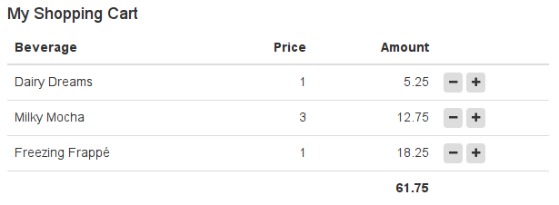

[<< return to the manuals](index.md)

Preliminary readings:

* [LaxarJS Core Concepts](../concepts.md)


# Widgets and Activities

Widgets and activities are the work horse of any LaxarJS application.
They make up the user interface and implement the (client-side) application logic.


## Delineating Widget Responsibilities

Before starting to implement your widget, take a moment to think about it's responsibilities.
You can do this by phrasing the question: _What task(s) does this widget help the user to accomplish?_
Are you thinking about a very broadly applicable, technical task such as _"allow the user to enter a date"_ or _"allow user to delete a data row"_?
In this case, you might want to implement this functionality as a _control_ (an AngularJS directive, or an HTML5 web component) and use it _within_ one or more of your widgets.
Usually, widgets correspond to significant areas of the screen and are composed from multiple controls, to allow the user to accomplish _specific_ tasks, such as _"allow user to book a flight"_ or _"allow user to review shopping cart contents"_.
If widgets are made too small and too generic, page definitions will be confusing and the widget configuration options become unwieldy.
As a rule of the thumb, only very complex pages should contain more than a about a dozen widgets.
And who wants to have very complex pages anyway?


### When to use Activities

Activities are often used to fetch and manage application resources.
Within the page, they may represent a REST API or a data store, and are responsible for fetching resources and performing relevant service calls (such as a form submission) upon action request.
Activities may also serve as a mediator between other widgets that use mutually incompatible event vocabularies (such as different resource formats).
This may happen when integrating widgets from third parties into an application.


## How to Create a Widget

The easiest way to create a widget is to use the appropriate `grunt-init` template.
Check out the [README](../../README.md) on how to obtain the grunt-init templates and on creating an application.

First, create a sub-directory for your new widget within a LaxarJS application:
Each widget in the application lives within a sub-folder such as `includes/widgets/shopping/cart_widget`.
In this example, _shopping_ is the widget category, which you an opportunity to organize widgets by their general business area: _shopping_, _social_, _finance_ and so on.
Next comes the widget name, which has to be application-wide unique.
Widgets always end in `_widget` whereas activities always end in `_activity`.

To create the actual widget, run:

```sh
    grunt-init laxar-widget
```

A wizard will ask for some details on the widget such as license and author, but you can always edit this information in the widget sources afterwards.
In the following steps, it is assumed that you used the category _shopping_ and the widget name _cart_widget_ as above.


### Widget Files

A newly created widget contains the following files:

* `widget.json`

  Meta information about your widget, used by the LaxarJS framework.
  Allows you to describe the configuration options for each feature of your widget using a JSON schema.

* `bower.json`

  This specifies the dependencies of your widget.
  While not used directly by LaxarJS, it is the key to automated, isolated widget tests.

* `cart_widget.js`

  This is implements the business logic of your shopping cart, such as calculating a total or changing item quantities, as an AngularJS controller.
  When your controller is instantiated by the LaxarJS runtime, it will receive an AngularJS scope (the model) and a reference to the event bus, which allows for communication with the world.
  When built for release, all controllers and their RequireJS-dependencies are bundled into a single, compressed JavaScript file.

* `default.theme/cart_widget.html`

  The AngularJS HTML template defining the appearance for your widget.
  When your widget is used on a page, LaxarJS will load this automatically and bind it to your widget controller's scope.
  By convention, Bootstrap 3 classes are used here, for uniform styling across widget.
  If this does not suit you, feel free to use a different framework (or none at all), but keep in mind that this limits opportunities for widget reuse.
  As with controllers, when your application is packaged for release, all widget templates will be preloaded within a single JSON file.

* `default.theme/(s)css/cart_widget.(s)css`

  Most of the time, your widget is fine using CSS style definitions from the global application theme.
  Sometimes though, you have style definitions which are widget-specific (such as CSS animations) and should not be part of the global theme.
  If your widget has a CSS file, the framework will load it when the widget is used in an application, and bundle it for release.

LaxarJS supports to change the appearance of an existing widget by overriding its template in a custom _theme_.
To get started and to add some simple styling, you do not have to concern yourself with themes, but they are very useful in adapt widgets to different applications and web sites.
Read [more about themes](./themes.md) when you are familiar with creating and using widgets.

* `spec/spec_runner.html`

  For convenience, LaxarJS provides a spec runner for each new widget, to run jasmine spec tests in the browser.
  This file does not need to be touched at all.

* `spec/spec_runner.js`

  Configuration for the spec test.
  This file needs to be modified only if widget-specific external dependencies are required during testing.

* `spec/cart_widget_spec.js`

  This is the actual jasmine spec test.
  The test harness providing a simulated LaxarJS event bus is already prepared.


### Implementing a Controller

LaxarJS creates an empty controller for you, along with some AngularJS infrastructure (module, injections).
For a shopping cart, this might be an appropriate implementation based on some dummy data.

```JS

    // ...

    function Controller( $scope ) {
       $scope.model = [ { label: "Dairy Dreams", price: 5.25, amount: 1 },
                        { label: "Milky Mocha", price: 12.75, amount: 3 },
                        { label: "Freezing Frappé", price: 18.25, amount: 1 } ];

       $scope.increment = function( item ) {
          ++item.amount;
       };

       $scope.decrement = function( item ) {
          item.amount = Math.max( 0, item.amount - 1 );
       };

       $scope.total = function( rows ) {
          return rows.reduce( function( acc, next ) {
             return acc + next.price*next.amount;
          }, 0 );
       };
    }

    // ...

```

We can see that a widget controller works just like any other AngularJS controller.
Of course, things will get more interesting once we use the event bus.


### Creating a Template

For anyone familiar with bootstrap and AngularJS, this should not be a surprise:

```HTML

    <h4 ng-bind-html="features.headline.htmlText"></h4>
    <table class="table">
       <thead>
       <tr>
          <th>Beverage</th>
          <th class="cart-price">Price</th>
          <th class="cart-amount">Amount</th>
          <th></th>
       </tr>
       </thead>
       <tfoot>
       <tr>
          <th colspan="3" class="cart-price">{{ total( model ) }}</th>
          <th></th>
       </tr>
       </tfoot>
       <tr ng-repeat="item in model">
          <td>{{ item.label }}</td>
          <td class="cart-amount">{{ item.amount }}</td>
          <td class="cart-price">{{ item.price }}</td>
          <td>
             <button data-ng-click="decrement( item )" class="btn btn-xs"><i class="fa fa-minus" /></button>
             <button data-ng-click="increment( item )" class="btn btn-xs"><i class="fa fa-plus" /></button>
          </td>
       </tr>
    </table>

```


### Adding Some Style

Thanks to Bootstrap, this widget does not require a lot of fancy styling:

```CSS

    .cart-widget .cart-amount,
    .cart-widget .cart-price {
       text-align: right;
    }

```

For best encapsulation, selectors are prefixed with the widget class as shown here, which will be added by LaxarJS when a widget is loaded.


### Configuration Options

You might have wondered where the `features.headline.htmlText` in the template came from.
This is a feature configuration option of our widget:
We want to be able to control the headline text for each instance of our widget.
For this reason, we make it configurable, by adding a feature entry to the `widget.json`:

```JSON

    {
       "name": "CartWidget",
       "description": "A simple shopping cart.",
       "version": {
          "spec": "0.1.0"
       },

       "integration": {
          "type": "angular"
       },

       "features": {
          "$schema": "http://json-schema.org/draft-04/schema#",
          "type": "object",
          "properties": {
             "headline": {
                "type": "object",
                "properties": {
                   "htmlText": {
                      "type": "string",
                      "description": "The HTML headline content."
                   }
                }
             }
          }
       }
    }

```

The _widget features_ are a [JSON schema](http://json-schema.org) document used by LaxarJS to verify pages.
It contains a property for each configurable feature, and it also allows to specify default values as needed.
This makes it easy to provide self-documenting customization options to your widget.


### Checking out the Result

Before we can take a look at the widget, we will need to integrate it into the page (`application/pages/page1.json`) provided by the demo application:

```JSON

    {
       "layout": "one_column",

       "areas": {
          "activities": [],
          "header": [],
          "content": [
              {
                 "widget": "shopping/cart_widget",
                 "features": {
                    "headline": {
                       "htmlText": "My Shopping Cart"
                    }
                 }
              }
          ],
          "footer": []
       }
    }

```

Now we can start the development web server provided by LaxarJS, from the application root:

```SH

    npm start

```

By navigating to `http://localhost:8000`, you may admire the fruits of your labor:



Now that we have covered the basics in writing widgets, let us have a closer look at widget testing.


## Testing a Widget

One of the Major Goals of LaxarJS is to simplify the development _and testing_ of isolated components.
For this reason, the testing infrastructure for your widget has already been added on creation.

### Writing a Spec-Test

TODO

### Running the Test

TODO

## LaxarJS Widget Reference

TODO

### Scope Properties

TODO

### The Widget Specification Format

TODO